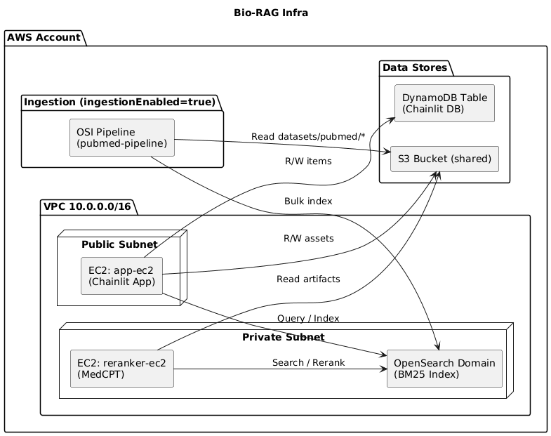

# Bio-RAG

## 📘 Overview

This repository defines the **production AWS infrastructure** for the Bio-RAG system. It instantiates a hardened, reusable, and modular deployment of the optimal architecture described in [_“Efficient and Reproducible Biomedical Question Answering using Retrieval Augmented Generation (RAG)”_](https://arxiv.org/abs/2505.07917) (Stuhlmann et al., 2025).

### 🧠 Summary of the Paper (Stuhlmann et al., 2025)

Stuhlmann et al. explore how to build a reproducible, scalable biomedical question-answering system by combining efficient retrieval with large language model generation. They evaluate sparse (BM25), dense (BioBERT), and hybrid retrieval strategies over PubMed, considering trade-offs in latency, indexing cost, and answer precision. Their findings show that a **hybrid pipeline** — using BM25 to select ~50 candidates, then reranking via a semantic cross-encoder (e.g. MedCPT) — delivers the best balance of accuracy (~0.90), recall, and latency (~1.9s) ([full paper on arXiv](https://arxiv.org/abs/2505.07917)).
This repo is an instantiation of that architecture, adapted for production on AWS.

## 🏗 Architecture & Design

Below is a UML/architecture diagram illustrating how the components interact:  


The key modules and relationships:

- **VPC, subnets, routing, and security groups**: isolates public and private resources, enforces least privilege.
- **App EC2**: hosts the LangChain-based application (located in the `langchain-app` submodule).
- **Reranker EC2**: GPU-backed instance; boots from a packaged artifact, installs from offline wheels, and runs the reranker server.
- **OpenSearch domain**: managed domain for indexing and serving biomedical abstracts.
- **Data pipeline (OSI)**: the ingest path from S3 → OpenSearch, gated behind a config switch `ingestionEnabled`.
- **Storage & state**: S3 buckets for artifacts and Chainlit persistence, DynamoDB for chat state.
- **IAM / roles / policies**: tailored permissions so each component has exactly what it needs (no more).

A core design decision: **everything needed for ingestion (OSI)** is isolated behind a **single config switch** (`ingestionEnabled`). Toggle it to deploy or tear down the ingestion pipeline without touching the rest.

## 🔧 Usage & Deployment (Infra Focus)

### Configuration

You can customize behavior via Pulumi configuration. Key config keys:

| Key                    | Default            | Purpose                                             |
| ---------------------- | ------------------ | --------------------------------------------------- |
| `ingestionEnabled`     | `false`            | Enable or disable the OpenSearch ingestion pipeline |
| `vpcCidr`              | `10.0.0.0/16`      | CIDR range for VPC                                  |
| `appPort`              | `8000`             | Port for the app server                             |
| `rerankerPort`         | `9000`             | Port for reranker server                            |
| `keyName`              | `Bio-RAG-key`      | EC2 key-pair name (must already exist)              |
| `allowedSshCidr`       | (unset)            | If set, allows SSH ingress to App EC2 from your IP  |
| `osBaseInstanceType`   | `t3.small.search`  | OpenSearch instance type in baseline mode           |
| `osIngestInstanceType` | `r7g.large.search` | OpenSearch instance type during ingestion mode      |
| `osBaseVolumeGiB`      | `30`               | EBS volume size baseline                            |
| `osIngestVolumeGiB`    | `30`               | EBS volume size ingest mode                         |
| _(others available)_   | _see infra code_   | Tuning knobs for bulk size, flush time, etc.        |

See the [langchain-app](./langchain-app) submodule for the application code deployed onto the App EC2 instance.

### Deployment

```bash
cd infra
# (activate your Python venv, install dependencies)
pulumi up
```
